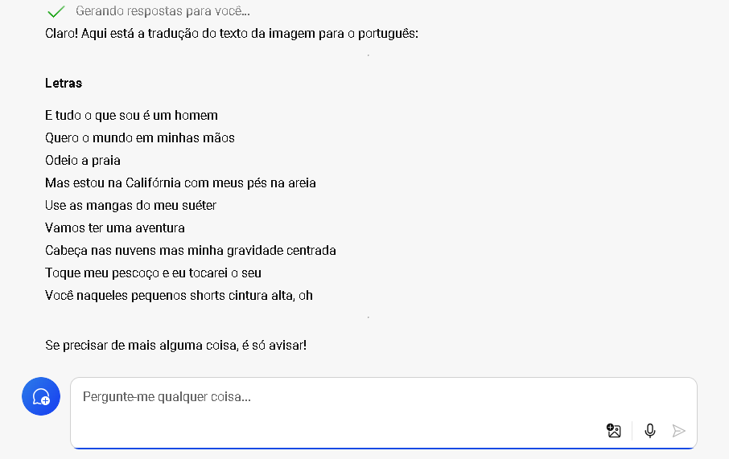

# Explorar a IA Generativa com Copilot

# Objetivo 1
1 Traduzir um trecho de musica do inglês para portugues.

# Entrada 1

# Saida 

# Objetivo 2 
1 Criar um codigo em python da cobrinha que cresce ao tocar no objeto criado randomicamente na tela
2 Teste se o game realmente funciona. E funciona!

# Entrada 2 

# Saida 

